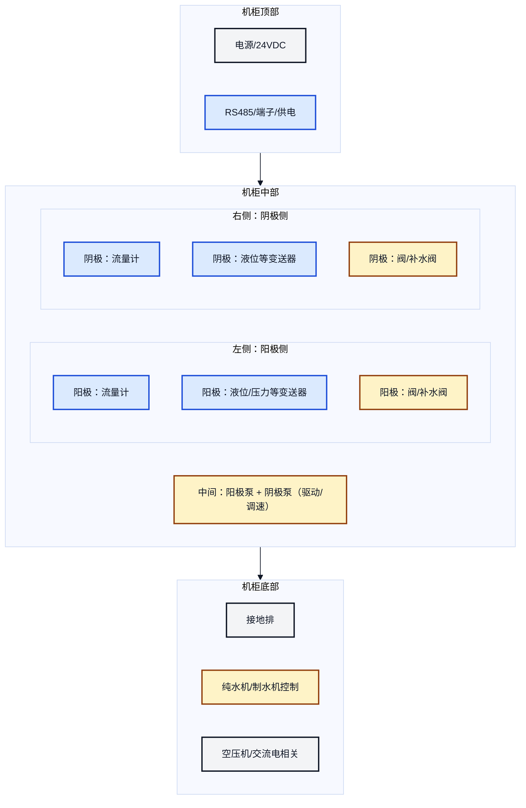
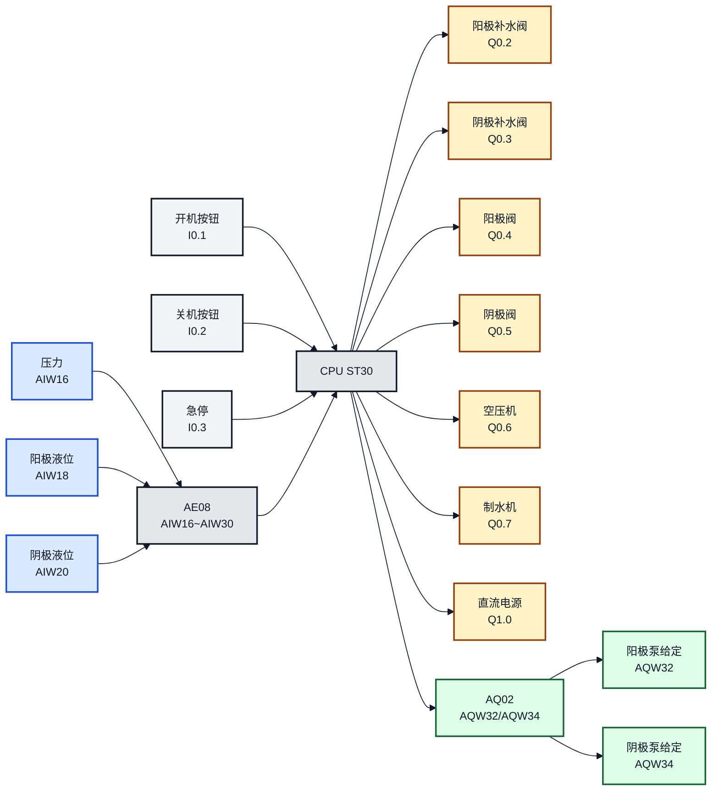

# 双氧水生产控制系统 - PLC 使用说明书（单文件版）

说明：本版本为“复制到在线 Markdown 系统”准备，图示采用 **内嵌 SVG**（不依赖外部文件，也不依赖 Mermaid）。

## 1. 硬件确认

本项目硬件固定如下：

- PLC：S7-200 SMART **CPU ST30**
- 右侧第 1 个模块：**AE08**（8 路 4-20mA 模拟量输入）
  - 模拟量输入地址：`AIW16` ~ `AIW30`
- 右侧第 2 个模块：**AQ02**（2 路模拟量输出）
  - 模拟量输出地址：`AQW32`、`AQW34`

### 模块布局示意图

MinDoc 一般会过滤内嵌 SVG/HTML，因此本“单文件粘贴版”默认使用 Mermaid（渲染为矢量图，可无限放大）。

```mermaid
%%{init: {'theme': 'base', 'themeVariables': { 'fontFamily': 'Arial', 'fontSize': '16px', 'primaryTextColor': '#111827', 'lineColor': '#111827' }}}%%
graph LR
  classDef cpu fill:#f3f4f6,stroke:#111827,stroke-width:2px,color:#111827;
  classDef ai  fill:#dbeafe,stroke:#1d4ed8,stroke-width:2px,color:#111827;
  classDef ao  fill:#dcfce7,stroke:#166534,stroke-width:2px,color:#111827;
  linkStyle 0,1 stroke:#111827,stroke-width:2px;

  CPU["CPU ST30"]:::cpu --> AE08["AE08<br/>8×4-20mA<br/>AIW16~AIW30"]:::ai --> AQ02["AQ02<br/>2×AO<br/>AQW32/AQW34"]:::ao
```

如果你的 MinDoc 未开启 Mermaid，可用下面的纯文本布局：

```text
CPU ST30  ->  AE08 (8×4-20mA, AIW16~AIW30)  ->  AQ02 (2×AO, AQW32/AQW34)
```

## 1.1 机柜基本布局（后门视角）

下面布局依据“从后门查看”的机柜草图整理，用于现场快速定位与走线分区理解：

- 顶部：电源/24VDC、RS485 端子与供电等
- 中部：左侧为阳极侧、右侧为阴极侧，中间为两路泵与驱动/调速
- 底部：接地排、纯水机/制水机控制、空压机与交流电相关



走线建议：
- 4-20mA 与 RS485 尽量走“信号线槽”，远离交流电与电机线
- 模拟量线建议用屏蔽双绞线，屏蔽层单端接地（接地排）
- 强弱电分槽/分层，交叉尽量 90°

## 2. 程序与文件

- PLC 导入用程序：`双氧水控制_v7.awl`
- 编辑查看用程序：`双氧水控制_v7_utf8.awl`
- 工艺说明：`开关机说明-V2.txt`
- 本说明书（仓库版）：`PLC使用说明书.md`

## 2.1 是否需要“向导”？

本项目当前版本使用 **AE08 模拟量输入（AIW16~AIW30）** 与 **AQ02 模拟量输出（AQW32/AQW34）**，不依赖 PWM/PTO/HSC/通信向导生成的程序块。

但仍需要在 Micro/WIN SMART 的 **系统块** 中确认：
- CPU 型号为 ST30
- 模块顺序为 AE08（第 1 个）+ AQ02（第 2 个），地址分别为 `AIW16` 起、`AQW32` 起
- 模拟量量程/类型（4-20mA、0-10V 等）与现场一致

## 3. 接线对照表（必须按表核对）

### 3.1 按钮输入（DI）

| PLC 地址 | 名称 | 建议接线 | 作用 |
|---|---|---|---|
| `I0.1` | 开机按钮 | 常开按钮 | 触发开机顺控 |
| `I0.2` | 关机按钮 | 常开按钮 | 触发关机顺控 |
| `I0.3` | 急停 | 建议常闭回路 | 立即停机并关闭所有输出 |

### 3.1.1 水流量计（霍尔脉冲）

本项目水流量计为霍尔脉冲输出型（方波），说明书要点如下（详见 `docs/937-15xxF01_GB.pdf`）：

- 输出方式：开集电极 **NPN**（Open collector NPN），方波输出
- 供电范围：**+3.8 ~ +24 VDC**
- 输出电平：被触发时将信号端拉到 0V（饱和压降 <0.7V），不触发时开路
- 说明书强调：不同介质/安装会导致 “Pulses/litre” 有偏差，建议整机管路条件下做标定

#### 3.1.1.1 接线建议（按 NPN 开集电极）

- 供电：流量计 + 接 +24V（或按现场实际供电），- 接 0V
- 信号：流量计 Signal 接到 PLC 的高速/普通输入点（建议单独占用输入点）
- 参考地：PLC 输入公共端与流量计 0V 同参考（避免漂移）
- 抗干扰：信号线用屏蔽线，远离接触器/变频器/电机线

提示：因为是 NPN “下拉到 0V”，在某些接法下 PLC 看到的是“低电平有效”的脉冲（逻辑相反）。程序取脉冲时只要选对“上升沿/下降沿”即可。

#### 3.1.1.2 脉冲换算（把脉冲变成流量）

先确认流量计喷嘴（Nozzle）型号，对应的 **Pulses/litre（每升脉冲数）** 参考表：

| 喷嘴直径 | Pulses/litre（每升脉冲数） |
|---|---:|
| Ø 1.00 mm | 2223 |
| Ø 1.20 mm | 1787 |
| Ø 2.00 mm | 1013 |
| Ø 2.50 mm | 754 |
| Ø 5.60 mm | 256 |

换算公式（推荐每 1 秒统计一次脉冲增量）：

- 设 `ΔP` = 1 秒内脉冲数（pulses/s）
- 设 `K` = Pulses/litre（pulses/L）
- **瞬时流量（L/min）**：`Flow = ΔP / K * 60`
- **累计体积（L）**：`Total_L = TotalPulses / K`

### 3.2 执行器输出（DO）

| PLC 地址 | 设备 | 说明 |
|---|---|---|
| `Q0.2` | 阳极补水电磁阀 | 开机补水用 |
| `Q0.3` | 阴极补水电磁阀 | 开机补水用 |
| `Q0.4` | 阳极控制电磁阀 | 空压机后延时开启 |
| `Q0.5` | 阴极液体电磁阀 | 阴极泵后延时开启 |
| `Q0.6` | 空压机（接触器/电磁阀） | 关机后延时 30 分钟关闭 |
| `Q0.7` | 纯水机/制水机 | 开机自动开启 |
| `Q1.0` | 直流电源开关控制 | 阴极阀开启 5 分钟后使能 |

### 3.3 模拟量输入（AE08，8×4-20mA）

| 通道 | PLC 地址 | 建议接入 | 用途 |
|---|---|---|---|
| CH0 | `AIW16` | 高压罐压力变送器 | 压力达标判定 |
| CH1 | `AIW18` | 阳极桶液位变送器 | 补水停止判定 |
| CH2 | `AIW20` | 阴极桶液位变送器 | 补水停止判定 |
| CH3~CH7 | `AIW22~AIW30` | 预留 | 预留 |

### 3.4 模拟量输出（AQ02，2×AO）

| 通道 | PLC 地址 | 建议接入 | 用途 |
|---|---|---|---|
| AO0 | `AQW32` | 阳极泵调速（变频器给定等） | 阳极泵流量/转速控制 |
| AO1 | `AQW34` | 阴极泵调速（变频器给定等） | 阴极泵流量/转速控制 |

安全策略：当对应泵未使能时，程序会将 `AQW32/AQW34` 强制输出为 0。

### 接线总览示意图




<svg xmlns="http://www.w3.org/2000/svg" width="1400" height="720" viewBox="0 0 1400 720">
  <rect x="0" y="0" width="1400" height="720" fill="#ffffff"/>
  <text x="40" y="60" font-family="Segoe UI, Arial, sans-serif" font-size="32" fill="#111827">接线总览示意（按钮/传感器/执行器）</text>

  <rect x="40" y="110" width="360" height="250" rx="16" fill="#f3f4f6" stroke="#111827" stroke-width="2"/>
  <text x="70" y="155" font-family="Segoe UI, Arial, sans-serif" font-size="26" fill="#111827">按钮输入（DI）</text>
  <text x="70" y="200" font-family="Segoe UI, Arial, sans-serif" font-size="20" fill="#374151">开机按钮：I0.1</text>
  <text x="70" y="235" font-family="Segoe UI, Arial, sans-serif" font-size="20" fill="#374151">关机按钮：I0.2</text>
  <text x="70" y="270" font-family="Segoe UI, Arial, sans-serif" font-size="20" fill="#374151">急停：I0.3（建议常闭）</text>

  <rect x="40" y="400" width="360" height="260" rx="16" fill="#dbeafe" stroke="#111827" stroke-width="2"/>
  <text x="70" y="445" font-family="Segoe UI, Arial, sans-serif" font-size="26" fill="#111827">传感器（4-20mA）</text>
  <text x="70" y="490" font-family="Segoe UI, Arial, sans-serif" font-size="20" fill="#374151">压力：AIW16（AE08 CH0）</text>
  <text x="70" y="525" font-family="Segoe UI, Arial, sans-serif" font-size="20" fill="#374151">阳极液位：AIW18（AE08 CH1）</text>
  <text x="70" y="560" font-family="Segoe UI, Arial, sans-serif" font-size="20" fill="#374151">阴极液位：AIW20（AE08 CH2）</text>
  <text x="70" y="595" font-family="Segoe UI, Arial, sans-serif" font-size="20" fill="#374151">其余通道：AIW22~AIW30（预留）</text>

  <rect x="520" y="210" width="360" height="300" rx="16" fill="#e5e7eb" stroke="#111827" stroke-width="2"/>
  <text x="550" y="255" font-family="Segoe UI, Arial, sans-serif" font-size="26" fill="#111827">PLC（CPU ST30）</text>
  <text x="550" y="295" font-family="Segoe UI, Arial, sans-serif" font-size="18" fill="#374151">右侧模块：AE08（AIW16 起）+ AQ02（AQW32 起）</text>

  <rect x="980" y="110" width="380" height="320" rx="16" fill="#fef3c7" stroke="#111827" stroke-width="2"/>
  <text x="1010" y="155" font-family="Segoe UI, Arial, sans-serif" font-size="26" fill="#111827">执行器输出（DO）</text>
  <text x="1010" y="200" font-family="Segoe UI, Arial, sans-serif" font-size="20" fill="#374151">阳极补水阀：Q0.2</text>
  <text x="1010" y="235" font-family="Segoe UI, Arial, sans-serif" font-size="20" fill="#374151">阴极补水阀：Q0.3</text>
  <text x="1010" y="270" font-family="Segoe UI, Arial, sans-serif" font-size="20" fill="#374151">阳极阀：Q0.4</text>
  <text x="1010" y="305" font-family="Segoe UI, Arial, sans-serif" font-size="20" fill="#374151">阴极阀：Q0.5</text>
  <text x="1010" y="340" font-family="Segoe UI, Arial, sans-serif" font-size="20" fill="#374151">空压机：Q0.6</text>
  <text x="1010" y="375" font-family="Segoe UI, Arial, sans-serif" font-size="20" fill="#374151">制水机：Q0.7</text>
  <text x="1010" y="410" font-family="Segoe UI, Arial, sans-serif" font-size="20" fill="#374151">直流电源：Q1.0</text>

  <rect x="980" y="470" width="380" height="190" rx="16" fill="#dcfce7" stroke="#111827" stroke-width="2"/>
  <text x="1010" y="515" font-family="Segoe UI, Arial, sans-serif" font-size="26" fill="#111827">泵调速给定（AO）</text>
  <text x="1010" y="560" font-family="Segoe UI, Arial, sans-serif" font-size="20" fill="#374151">阳极泵给定：AQW32</text>
  <text x="1010" y="595" font-family="Segoe UI, Arial, sans-serif" font-size="20" fill="#374151">阴极泵给定：AQW34</text>

  <line x1="400" y1="235" x2="520" y2="280" stroke="#111827" stroke-width="3"/>
  <polygon points="520,280 507,272 509,287" fill="#111827"/>

  <line x1="400" y1="530" x2="520" y2="405" stroke="#111827" stroke-width="3"/>
  <polygon points="520,405 507,408 516,418" fill="#111827"/>

  <line x1="880" y1="310" x2="980" y2="270" stroke="#111827" stroke-width="3"/>
  <polygon points="980,270 967,263 968,278" fill="#111827"/>

  <line x1="880" y1="440" x2="980" y2="555" stroke="#111827" stroke-width="3"/>
  <polygon points="980,555 968,547 967,562" fill="#111827"/>

  <text x="40" y="700" font-family="Segoe UI, Arial, sans-serif" font-size="16" fill="#6b7280">提示：如需打印，建议用 A4 横向；图中为逻辑对照，电气细节以柜内图纸为准。</text>
</svg>

## 4. 操作方法

### 4.1 开机

1. 打开总电源
2. 确认急停已释放
3. 按下 **开机按钮（I0.1）**
4. 系统自动执行：补水 → 空压机 → 阳极阀/泵 → 压力达标 → 阴极泵/阀 → 延时 5 分钟 → 直流电源

### 4.2 关机

1. 按下 **关机按钮（I0.2）**
2. 系统立即关闭直流电源、阀、泵、制水机
3. **30 分钟后**自动关闭空压机

### 4.3 急停

按下 **急停（I0.3）**：系统立即关闭所有输出。排故完成后释放急停，再按开机。
