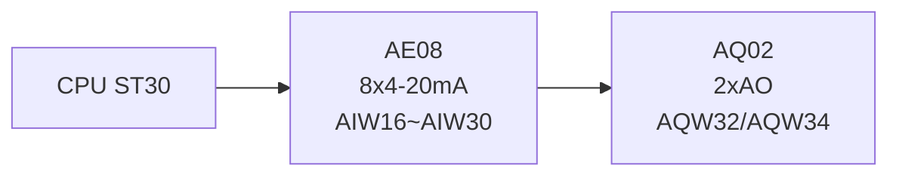
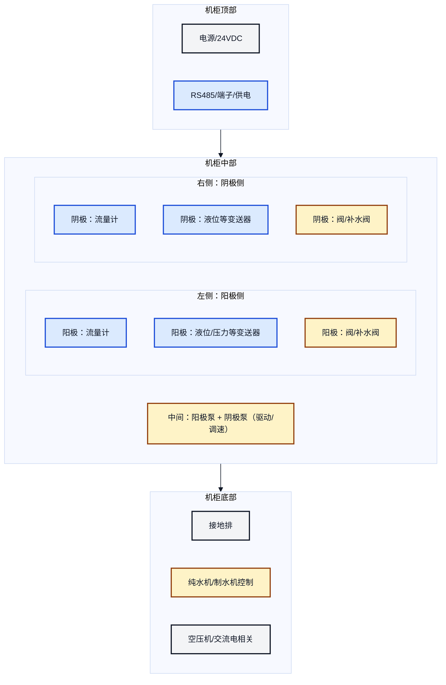
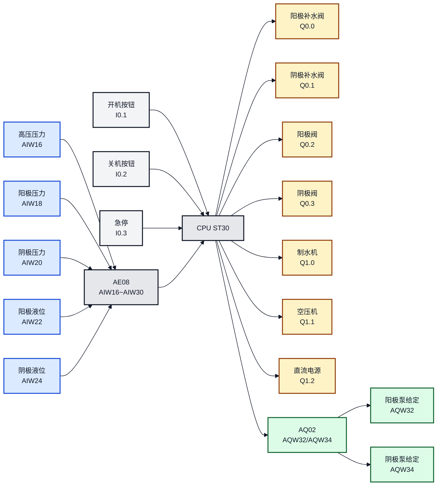
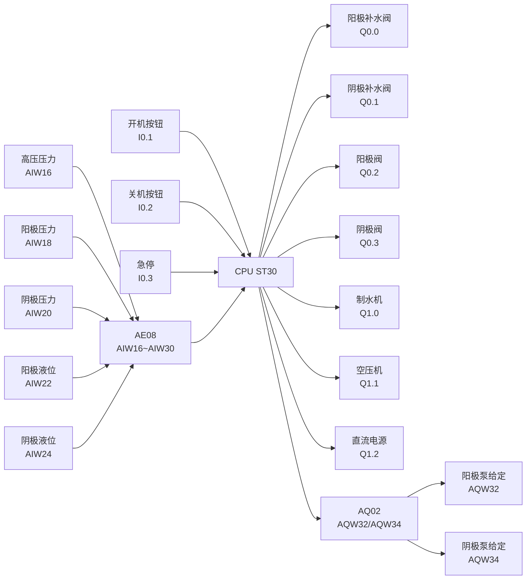

# 双氧水生产控制系统 - PLC 使用说明书

本说明书面向设备使用与维护人员，用于确认硬件配置、接线对应关系，以及开机/关机的操作方法。

## 1. 硬件确认

本项目硬件固定如下：

- PLC：S7-200 SMART **CPU ST30**
- 右侧第 1 个模块：**AE08**（8 路 4-20mA 模拟量输入）
  - 模拟量输入地址：`AIW16` ~ `AIW30`
- 右侧第 2 个模块：**AQ02**（2 路模拟量输出）
  - 模拟量输出地址：`AQW32`、`AQW34`

> 图示说明：为保证离线可用，本说明书使用“本地 SVG 图片 + Mermaid（可选）”。
> - 若你的 Markdown 预览不支持 Mermaid，直接看下面的 SVG 图片即可。

如果你使用的是 **MinDoc** 之类的在线文档系统（通常会过滤 SVG/HTML），推荐直接使用 Mermaid 图示（渲染为矢量图，可无限放大）。

```mermaid
%%{init: {'theme': 'base', 'themeVariables': { 'fontFamily': 'Arial', 'fontSize': '16px', 'primaryTextColor': '#111827', 'lineColor': '#111827' }}}%%
graph LR
  classDef cpu fill:#f3f4f6,stroke:#111827,stroke-width:2px,color:#111827;
  classDef ai  fill:#dbeafe,stroke:#1d4ed8,stroke-width:2px,color:#111827;
  classDef ao  fill:#dcfce7,stroke:#166534,stroke-width:2px,color:#111827;
  linkStyle 0,1 stroke:#111827,stroke-width:2px;

  CPU["CPU ST30"]:::cpu --> AE08["AE08<br/>8×4-20mA<br/>AIW16~AIW30"]:::ai --> AQ02["AQ02<br/>2×AO<br/>AQW32/AQW34"]:::ao
```



若在线文档系统不支持 Mermaid，可直接使用下面的纯文本示意：

```text
CPU ST30  ->  AE08 (8×4-20mA, AIW16~AIW30)  ->  AQ02 (2×AO, AQW32/AQW34)
```

## 1.1 机柜基本布局（后门视角）

下面布局依据你提供的“从后门查看”的机柜草图整理，用于现场找线、对照接线与分区走线：

- 顶部：电源/24VDC、RS485 端子与供电等
- 中部：左侧为阳极侧、右侧为阴极侧，中间为两路泵与驱动/调速
- 底部：接地排、纯水机/制水机控制、空压机与交流电相关



走线建议（现场维护视角）：
- 4-20mA 与 RS485 走“信号线槽”，尽量远离交流电与电机/接触器走线
- 模拟量线使用屏蔽双绞线，屏蔽层单端接地（优先接机柜接地排）
- 强电线与弱电线必须分槽/分层走线，交叉时尽量 90° 交叉

## 2. 程序与文件

- PLC 导入用程序：`双氧水控制_v16_防干烧修复_ansi.awl`
- 工艺说明：`开关机说明-V2.txt`

### 变量地址映射表 (V区)

为了方便 HMI (触摸屏) 对接，系统参数已全部集中在 V 区：

**设定参数区 (HMI 可读写，建议断电保持)：**
| 地址 | 类型 | 默认值 | 用途说明 |
|---|---|---|---|
| `VD2000` | Real (实数) | 1.5 | 压力超限报警值 (MPa) |
| `VD2004` | Real (实数) | 10.0 | 液位过低报警值 (%) - 仅泵运行时生效 |
| `VD2008` | Real (实数) | 0.2 | 泵启动允许压力下限 (MPa) |
| `VD2012` | Real (实数) | 80.0 | 制水完成目标液位 (%) |
| `VD2016` | Real (实数) | 2223.0 | 流量计脉冲系数 (K值, Pulses/L) |
| `VW2020` | INT (整数) | 13824 | 泵运行给定速度 (0-27648对应0-100%) |
| `VW2022` | INT (整数) | 18000 | 关机空压机延时时间 (0.1秒为单位，18000=30分钟) |

**状态监控区 (HMI 只读)：**
| 地址 | 类型 | 用途说明 |
|---|---|---|
| `VD2100` | Real | 当前实时压力 (MPa) |
| `VD2104` | Real | 当前阳极液位 (%) |
| `VD2108` | Real | 当前阴极液位 (%) |
| `VD2112` | Real | 当前阳极压力 (MPa) |
| `VD2116` | Real | 当前阴极压力 (MPa) |
| `VD1310` | Real | 阳极(流量计1) 瞬时流量 (L/min) |
| `VD1314` | Real | 阳极(流量计1) 累计流量 (L) |
| `VD1330` | Real | 阴极(流量计2) 瞬时流量 (L/min) |
| `VD1334` | Real | 阴极(流量计2) 累计流量 (L) |
| `VB100` | Byte | 当前开机步序 (10=补水, 20=空压机...100=正常运行) |

**按钮与报警 (HMI 交互)：**
| 地址 | 类型 | 用途说明 |
|---|---|---|
| `V2302.0` | Bool | 触摸屏开机按钮 (并联I0.1) |
| `V2302.1` | Bool | 触摸屏关机按钮 (并联I0.2) |
| `V2303.0` | Bool | 报警标志：压力超限 |
| `V2303.1` | Bool | 报警标志：阳极液位过低 |
| `V2303.2` | Bool | 报警标志：阴极液位过低 |

### 是否需要“向导”？

本项目当前版本使用 **AE08 模拟量输入（AIW16~AIW30）** 与 **AQ02 模拟量输出（AQW32/AQW34）**，不依赖 PWM/PTO/HSC/通信向导生成的程序块。

但仍需要在 Micro/WIN SMART 的 **系统块** 中确认：
- CPU 型号为 ST30
- 模块顺序为 AE08（第 1 个）+ AQ02（第 2 个），地址分别为 `AIW16` 起、`AQW32` 起
- 模拟量量程/类型（4-20mA、0-10V 等）与现场一致

## 3. 接线对照表（必须按表核对）

### 3.1 按钮输入（DI）

| PLC 地址 | 名称 | 建议接线 | 作用 |
|---|---|---|---|
| `I0.1` | 开机按钮 | 常开按钮 | 触发开机顺控 |
| `I0.2` | 关机按钮 | 常开按钮 | 触发关机顺控 |
| `I0.3` | 急停 | 建议常闭回路 | 立即停机并关闭所有输出 |

备注：若急停采用常闭回路，请在电气上保证“断线=停机”。

### 3.1.1 水流量计（霍尔脉冲）

本项目水流量计为霍尔脉冲输出型（方波），说明书要点如下（详见 `docs/937-15xxF01_GB.pdf`）：

- 输出方式：开集电极 **NPN**（Open collector NPN），方波输出
- 供电范围：**+3.8 ~ +24 VDC**
- 输出电平：被触发时将信号端拉到 0V（饱和压降 <0.7V），不触发时开路
- 说明书强调：不同介质/安装会导致 “Pulses/litre” 有偏差，建议整机管路条件下做标定

#### 3.1.1.1 接线建议（按 NPN 开集电极）

现场接线目标是让 PLC 能稳定采到脉冲：

- 供电：流量计 + 接 +24V（或按现场实际供电），- 接 0V
- 信号：流量计 Signal 接到 PLC 的高速/普通输入点（建议单独占用输入点）
- 参考地：PLC 输入公共端与流量计 0V 同参考（避免漂移）
- 抗干扰：信号线用屏蔽线，远离接触器/变频器/电机线

提示：因为是 NPN “下拉到 0V”，在某些接法下 PLC 看到的是“低电平有效”的脉冲（逻辑相反）。程序取脉冲时只要选对“上升沿/下降沿”即可。

#### 3.1.1.2 脉冲换算（把脉冲变成流量）

先确认流量计喷嘴（Nozzle）型号，对应的 **Pulses/litre（每升脉冲数）** 参考表：

| 喷嘴直径 | Pulses/litre（每升脉冲数） |
|---|---:|
| Ø 1.00 mm | 2223 |
| Ø 1.20 mm | 1787 |
| Ø 2.00 mm | 1013 |
| Ø 2.50 mm | 754 |
| Ø 5.60 mm | 256 |

换算公式（推荐每 1 秒统计一次脉冲增量）：

- 设 `ΔP` = 1 秒内脉冲数（pulses/s）
- 设 `K` = Pulses/litre（pulses/L）
- **瞬时流量（L/min）**：`Flow = ΔP / K * 60`
- **累计体积（L）**：`Total_L = TotalPulses / K`

### 3.2 执行器输出（DO）

| PLC 地址 | 设备 | 说明 |
|---|---|---|
| `Q0.0` | 阳极补水电磁阀 | 独立控制，开机补水用 |
| `Q0.1` | 阴极补水电磁阀 | 独立控制，开机补水用 |
| `Q0.2` | 阳极控制电磁阀 | 空压机后延时开启 |
| `Q0.3` | 阴极控制电磁阀 | 阴极泵后延时开启 |
| `Q0.4` ~ `Q0.7` | 预留 | 预留 |
| `Q1.0` | 纯水机/制水机 | 任一桶缺水即开启，双桶满则停 |
| `Q1.1` | 空压机（接触器/电磁阀） | 关机后延时 30 分钟关闭 |
| `Q1.2` | 直流电源开关控制 | 阴极阀开启 5 分钟后使能 |

### 3.3 模拟量输入（AE08，8×4-20mA）

| 通道 | PLC 地址 | 建议接入 | 程序内部用途 |
|---|---|---|---|
| CH0 | `AIW16` | 高压罐压力变送器 | 压力达标判定 |
| CH1 | `AIW18` | 阳极压力变送器 | 状态监控 |
| CH2 | `AIW20` | 阴极压力变送器 | 状态监控 |
| CH3 | `AIW22` | 阳极桶液位变送器 | 补水停止判定 |
| CH4 | `AIW24` | 阴极桶液位变送器 | 补水停止判定 |
| CH5 | `AIW26` | 预留 | 预留 |
| CH6 | `AIW28` | 预留 | 预留 |
| CH7 | `AIW30` | 预留 | 预留 |

说明：程序当前使用“原始值阈值”做判定（现场需要按量程标定后再定阈值）。

### 3.4 模拟量输出（AQ02，2×AO）

| 通道 | PLC 地址 | 建议接入 | 用途 |
|---|---|---|---|
| AO0 | `AQW32` | 阳极泵调速（如变频器给定） | 阳极泵流量/转速控制 |
| AO1 | `AQW34` | 阴极泵调速（如变频器给定） | 阴极泵流量/转速控制 |

安全策略：当对应泵未使能时，程序会将 `AQW32/AQW34` 强制输出为 0。





若在线文档系统不支持 Mermaid，可直接使用下面的纯文本示意：

```text
按钮：I0.1(开机) / I0.2(关机) / I0.3(急停)
传感器：AIW16(高压压力) / AIW18(阳极压力) / AIW20(阴极压力) / AIW22(阳极液位) / AIW24(阴极液位)

PLC ST30 + AE08 + AQ02
  DO：Q0.0 Q0.1 Q0.2 Q0.3 Q1.0 Q1.1 Q1.2  -> 阀/空压机/制水机/直流电源
  AO：AQW32(阳极泵给定) / AQW34(阴极泵给定) -> 变频器/调速器
```

## 4. 操作方法

### 4.1 开机

1. 打开总电源
2. 确认急停已释放（急停回路正常）
3. 按下 **开机按钮（I0.1）**
4. 系统自动执行顺控：补水 → 空压机 → 阳极阀/泵 → 压力达标 → 阴极泵/阀 → 延时 5 分钟 → 直流电源

### 4.2 关机

1. 按下 **关机按钮（I0.2）**
2. 系统立即关闭直流电源、阀、泵、制水机
3. **30 分钟后**自动关闭空压机

### 4.3 急停

按下 **急停（I0.3）**：系统立即关闭所有输出。排故完成后释放急停，再按开机。

## 5. 快速排障

| 现象 | 优先检查 |
|---|---|
| 按开机无反应 | `I0.3` 急停是否处于触发状态；`I0.1` 是否有变化 |
| 一直在补水不停 | `AIW22/AIW24` 是否有数值变化；液位阈值是否过高 |
| 阳极泵不转 | 泵驱动方式（PWM/模拟量给定）是否接对；`AQW32` 或 PWM 输出是否有信号 |
| 阴极阀不打开 | `Q0.3` 是否输出；阴极泵是否已启动并完成 3 秒延时 |
| 关机后空压机不延时 | `Q1.1` 是否被其他逻辑控制；是否等待满 30 分钟 |

## 6. 现场维护建议

- 模拟量（4-20mA）建议使用屏蔽线，屏蔽层单端接地
- 电磁阀/接触器建议使用中间继电器隔离驱动
- 首次联调建议先断开执行器负载，仅观察 PLC I/O 指示与表计数值
