# 色谱气路逻辑与动画演示

本章节演示了 10 通阀和 6 通阀在色谱边缘工作站中的物理气路与中心切割、反吹逻辑。

## 1. 10通阀双柱系统：轻重组分分离与反吹

**应用场景**：分析环境或工业气体中的轻组分（$H_2, O_2, N_2, CH_4, CO$），同时将重组分（如 $CO_2$ 及水分）反吹排出，防止污染分子筛分析柱。

**分离逻辑**：
1. **预柱粗分离**：混合气首先进入 JN.PN 预柱。轻组分跑得快，作为整体气团率先切入分析柱；重组分跑得慢，滞留在预柱中。
2. **中心切割**：在轻组分刚好全部进入分析柱，而重组分尚未到达时，执行切阀操作（状态 1 -> 状态 2）。
3. **原路反吹**：切阀后，反吹载气从反方向流过预柱，将滞留的重组分原路吹出至排空口。
4. **精细分离**：进入 JN.13x 分子筛的轻组分气团，在柱内经过长时间保留，按物理属性逐渐拉开距离，最终分离为 5 个独立的组分峰进入检测器。

  

---

## 2. 6通阀单柱系统：四氢噻吩 (THT) 进样与分离

**应用场景**：天然气中四氢噻吩 (THT) 臭味剂的单组分定量分析。

**分离逻辑**：
1. **取样阶段**：样品气流经定量环，多余气体排空，此时定量环内充满纯样气。
2. **进样阶段**：切阀后，载气将定量环中的整段样气推入特氟龙分析柱（JN.THT）。
3. **柱内分离**：目标物四氢噻吩与天然气基质（如甲烷等背景气体）在柱内按保留时间差异分离，先后进入检测器出峰。

  

